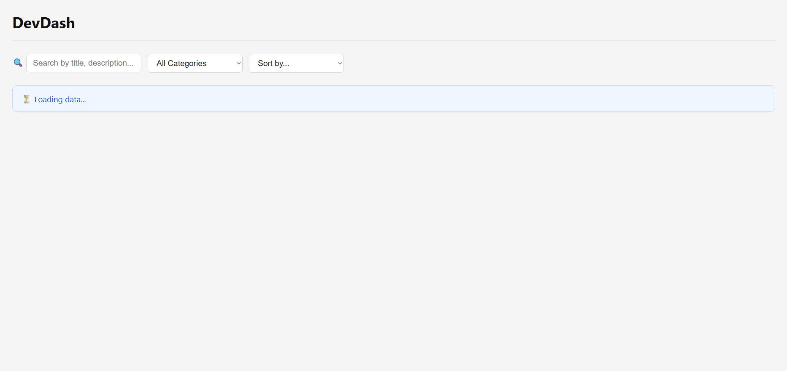
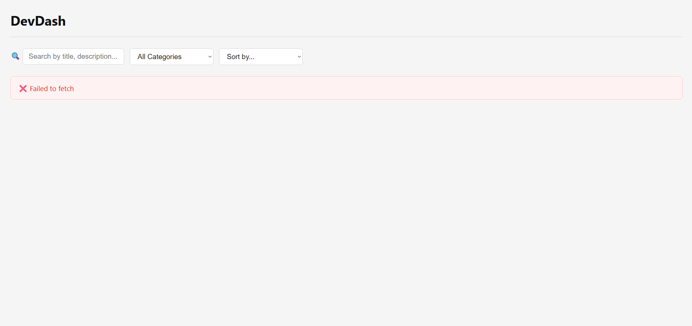

# DevDash — Typed Async Product Dashboard

A single-page TypeScript dashboard that fetches real product data from [DummyJSON API](https://dummyjson.com/). Users can browse products, search, filter by category, sort by price or name, and view product details with related items. Built with **Vite + TypeScript** (`strict: true`) — no frameworks.

---

## Short Description

DevDash is a single-page dashboard application that demonstrates typed, asynchronous JavaScript. It loads product and category data in parallel, transforms it with higher-order functions, and manages UI state via a discriminated union. All app logic is written in TypeScript with `strict: true` and zero `any` on domain data.

---

## Screenshots

- **Dashboard (`index.html`)** — Product grid with search, category filter, and sort controls.
  - *Loading state:*
    
  - *Product grid view:*
    

- **Product Detail** — Full product info with discount, stock, rating, and related products.
  

- **Error State** — Visible error banner when the API call fails.
  

---

## Local Run Instructions

Requires **Node.js 18+** and **npm**.

**Option 1 — Dev server (recommended):**

```bash
git clone https://github.com/Tungnthe186091/ajt-devdash-tungnt188.git
cd ajt-devdash-tungnt188
npm install
npm run dev
```

Then open `http://localhost:5173` in your browser.

**Option 2 — Production build:**

```bash
npm run build
npm run preview
```

**Type-check only (no output):**

```bash
npx tsc --noEmit
```

---

## Completed Features

### Pass Tier

- [x] Project compiles with `"strict": true` and no type errors
- [x] Domain data modelled with `interface` types (`Product`, `Category`, `ProductsResponse`) — no `any` on fetched data
- [x] Fetches and renders product list using `async/await` with loading, success, and error states
- [x] All functions and parameters correctly type-annotated with explicit return types
- [x] `try/catch` error handling with a visible error banner in the UI
- [x] Detail view fetches a single product by ID (`?id=` via `fetchProductById`)

### Good Tier

- [x] Search by title/description + filter by category + sort by price/name — all combined, implemented with `filter` and `sort` (higher-order functions)
- [x] Generic `fetchJson<T>(url: string): Promise<T>` helper used across all API calls in `api.ts`
- [x] `Promise.all` parallel loading in two places: dashboard init (products + categories) and detail view (product + related)
- [x] Application state modelled as a **discriminated union** `AppState` with four variants: `idle | loading | success | error`

### Excellent Tier

- [x] **Discriminated union exhaustively narrowed** — `switch` on `status` with a `default: never` branch that causes a compile error if a variant is ever missed
- [x] **Utility types** used as DTOs: `ProductUpdate` (`Partial<Pick<>>`), `ProductCard` (`Pick`), `ProductDraft` (`Omit`), `CategoryMap` (`Record`)
- [x] **Generic `createTTLCache<T>` factory** with a constraint (`T`) — closure-based TTL cache for detail page responses
- [x] **Debounce** on search input (300 ms) and **memoize** on detail fetch — both closure-based generics in `utils.ts`
- [x] Clean module architecture with single-responsibility files; README with run instructions

---

## Project Structure

```
ajt-devdash-tungnt188/
├── index.html
├── package.json
├── tsconfig.json          # "strict": true, "erasableSyntaxOnly": true
├── styles.css
└── src/
    ├── main.ts            # Entry point — init(), bindControls(), handleCardClick()
    ├── types.ts           # Product, Category, AppState (discriminated union), utility types
    ├── api.ts             # fetchJson<T>, fetchProducts, fetchCategories, fetchProductDetail
    ├── state.ts           # Module-level AppState store — getState / setState / getAllProducts
    ├── ui.ts              # renderStatus, renderProductList, renderProductDetail, showListView
    └── utils.ts           # debounce, memoize, createTTLCache
```

---

## Links

- **GitHub Repo:** `https://github.com/nutne88/ajt-devdash-tungnt188/`
- **Live Demo:** `https://ajt-devdash-tungnt188-b976.vercel.app/`

---

_AJT Long Assignment · TungNT188 · 2026_
